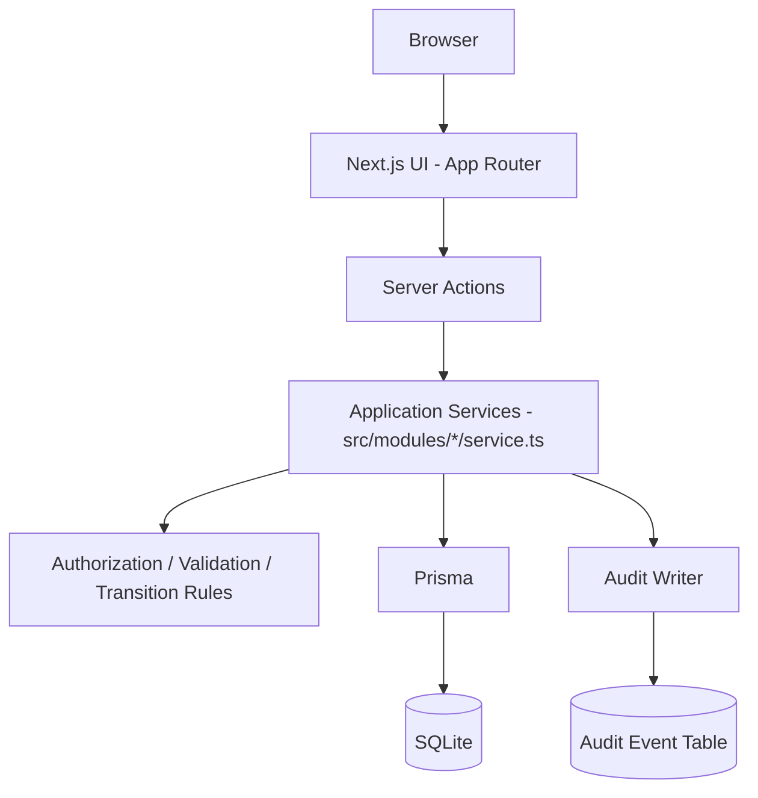

# Fintech Operations Console

A Devin-built proof of concept for engineering-owned internal tools.

## A. Executive Summary

This repository contains a working internal-operations console with three modules — a deep **KYC review queue**, a lightweight **refunds** workflow, and a lightweight **feature-flag administration** panel — plus a central, read-only **audit log**.

It tests this hypothesis: *Devin can reduce the engineering effort required to build a reusable internal-tools golden path, but the client must still own the runtime, identity, authorization, audit architecture, deployment, monitoring, compliance controls, and ongoing maintenance.*

It is **not** a general-purpose Power Apps replacement: there is no page builder, schema designer, connector marketplace, or workflow engine. It is an opinionated, code-based golden path intended to be repeated for future internal tools.

All data is **synthetic** (`.test` email domain, invented people and amounts). No production systems, credentials, or external services are used. **This application is not production-ready** — see [Production Gaps](#j-production-gaps).

## B. Demonstrated Capabilities

- **KYC workflow**: searchable/filterable queue, case detail with synthetic supporting facts, assignment (`Assign to me`), controlled decisions (approve / reject / request information / resume review), and a case-level audit timeline.
- **Refund workflow**: queue with search and status filter, detail view, approve/reject with a required decision note.
- **Feature-flag workflow**: searchable list with environment and state filters; enable/disable is a privileged, confirmed action requiring a change reason.
- **Role-based actions**: a central role→permission map enforced server-side via `requirePermission` (`src/lib/authorization/permissions.ts`).
- **Controlled state transitions**: declarative transition maps enforced server-side (`src/lib/transitions`, `KYC_TRANSITIONS`, `REFUND_TRANSITIONS`).
- **Audit events**: every successful mutation writes an append-only audit event in the **same database transaction** as the business change (`src/lib/audit/writer.ts`).
- **Shared module patterns**: shared shell, data table, filter bar, status badge, action dialog, audit timeline, and module registry reused by all modules.
- **Devin-ready repository instructions**: `AGENTS.md` plus the `.agents/skills/add-internal-tool-module` Skill for adding future modules.

## C. Architecture



All mutations flow through server-side application services; React components never contain authoritative authorization or transition logic. The identity cookie stores only an allowlisted persona ID; the server resolves the user and role from the database.

**Note:** production internal tools should generally call the company's existing source-of-truth services (KYC vendor, payments ledger, flag service) rather than create a new shadow database, as this prototype does for demonstration.

## D. Local Setup

```bash
npm install        # also runs `prisma generate`
npm run db:reset   # create + seed the local SQLite database
npm run dev        # http://localhost:3000
```

No external accounts or credentials are required. The committed `.env` contains only the local SQLite path.

## E. Demo Personas

Switch personas from the header ("Demo identity — not production authentication").

| Persona | Email | Role | Permissions |
| --- | --- | --- | --- |
| Alex Reviewer | `alex.reviewer@example.test` | `REVIEWER` | View/assign KYC cases, decide cases assigned to them, decide refunds, view flags, view audit log. **Cannot modify feature flags.** |
| Morgan Admin | `morgan.admin@example.test` | `ADMIN` | All reviewer permissions, decide any KYC case regardless of assignment, modify feature flags. |

## F. Reproducible Demo Script

1. As **Alex Reviewer**, open **KYC Review** → `KYC-1001` → **Assign to me** → the case moves to *In Review* → **Approve** with a note ≥ 10 characters → status becomes *Approved* and the audit timeline shows both actions.
2. Still as Alex, open **Feature Flags** → the Enable/Disable buttons are disabled ("Requires the FEATURE_FLAG_MANAGE permission").
3. Switch to **Morgan Admin** → **Feature Flags** → `instant-refunds-v2` (PRODUCTION) → **Enable** with a change reason → state flips and the audit log records the change.
4. Open **Refunds** → `RF-2001` → **Approve refund** with a note → status becomes *Approved*; check **Audit Log** for the full trail.

## G. Tests

```bash
npm run lint       # ESLint
npm run typecheck  # tsc --noEmit
npm test           # Vitest service-level integration tests (isolated SQLite db)
npm run build      # production build
npm run check      # all of the above
```

The tests exercise the real service, authorization, validation, transition, and audit code against an isolated SQLite database (`prisma/vitest.db`):

| Test | Proves |
| --- | --- |
| `tests/kyc.test.ts` — permitted action | Alex can assign and approve `KYC-1001`; audit events with before/after states are created. |
| `tests/kyc.test.ts` — invalid transition | A decided case cannot be re-decided; no state change, no audit event. |
| `tests/kyc.test.ts` — reviewer boundary | Alex cannot decide a case assigned to another reviewer; admins can. No state change, no audit event on denial. |
| `tests/kyc.test.ts` — validation | Notes under 10 characters are rejected with a typed error. |
| `tests/feature-flags.test.ts` — unauthorized action | Alex toggling `instant-refunds-v2` through the real service is rejected; flag and audit log unchanged. Morgan succeeds with audit. |
| `tests/refunds.test.ts` — refund audit | Deciding `RF-2001` records actor, reason, before and after state. |
| `tests/atomicity.test.ts` — atomicity | A forced audit-write failure rolls back the business mutation. |

**Final results:** all checks pass (`npm run check`: lint ✓, typecheck ✓, 10/10 tests ✓, build ✓).

## H. Adding a Fourth Module

1. Define the entity in `prisma/schema.prisma` and add synthetic seed data in `prisma/seed.ts`.
2. Create `src/modules/<module>/service.ts` with Zod input schemas, `requirePermission` checks, a transition map enforced with `assertTransition`, and `writeAuditEvent` inside the same `$transaction`.
3. Add permissions to `src/lib/authorization/permissions.ts` (central role map only).
4. Build pages under `src/app/<module>/` reusing `DataTable`, `FilterBar`, `StatusBadge`, `ActionDialog`, and `AuditTimeline`; mutations go through server actions that call the service.
5. Register the module in `src/modules/registry.ts` (navigation).
6. Add permitted-action, denied-action, invalid-transition, and audit tests under `tests/`.
7. Run `npm run check`, verify in the browser, and open a pull request.

See the repository Skill: `.agents/skills/add-internal-tool-module/SKILL.md`.

## I. Parallel Development Model

This prototype was built in a **single Devin session executing the workstreams sequentially** (core platform services → shell and shared UI → KYC → refunds and feature flags → quality and documentation). Shared contracts (permission model, transition helper, audit writer, error types) were established before module implementation, so the same structure supports parallel agents. No parallel child sessions were used: for a repository of this size, sequential implementation by one agent was faster and avoided integration overhead; this is documented honestly rather than claimed otherwise. File ownership and integration rules for future parallel work are defined in `AGENTS.md`. Validation after integration: `npm run check` plus the manual browser scenarios below.

## J. Production Gaps

This prototype deliberately omits, and a production adoption would still require:

- Real enterprise SSO and MFA (identity here is a demo cookie).
- Fine-grained and record-level authorization; segregation of duties (e.g. requester ≠ approver).
- Integration with source-of-truth APIs (KYC vendor, payments ledger, flag service) instead of a local shadow database.
- External-call idempotency and reconciliation.
- Tamper-evident audit retention (the audit table is append-only at the application layer only).
- Compliance-approved logging and data retention.
- Secrets management, network controls, deployment environments.
- Monitoring, alerting, backup and disaster recovery.
- Performance/load testing, security testing, accessibility validation.
- Incident response, support ownership, and upgrade/dependency-management ownership.

## K. Prototype Scope

**Implemented:** everything in section B; optimistic concurrency (a `version` field with `expectedVersion` support in every service — currently exercised by tests and available to callers, the UI does not yet send `expectedVersion`); the six required automated boundary tests; responsive-at-375px layout; documentation, Skill, and PR template.

**Deferred:** automated browser tests (manual browser validation documented instead); UI-level optimistic-locking wiring; pagination (dataset is small and capped).

**Known defects:** none known at delivery time.

**Human intervention:** none — built autonomously by Devin from the task specification.

**Architectural deviations:** none material; the suggested structure and stack were used.

**Parallel workstreams:** none (see section I).

**Integration issues:** none.

**Explicit exclusions:** page builders, low-code platform features, workflow designers, connector marketplaces, Microsoft/Power Apps integration, real KYC/payment/flag providers, real customer data, file upload/document storage, SSO/MFA/user provisioning/passwords, multi-tenancy, mobile-native, offline mode, production deployment/IaC/HA/DR, compliance certification, penetration testing, production-grade audit retention.

This prototype is **not** compliant, **not** secure for production, and **not** a complete Power Apps substitute.

## Screenshots

See `docs/screenshots/`: KYC queue, KYC case detail with audit timeline, feature flags, central audit log, and a mobile-width (375px) view.
